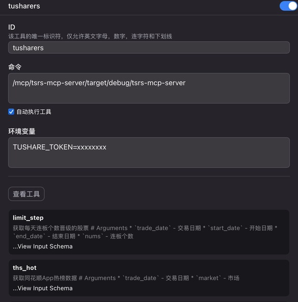

# tsrs-mcp-server

这是一个基于 `Model Context Protocol (MCP)` 的TuShare数据服务器，提供了一系列股票市场数据查询接口。

## 项目简介

本项目是一个Rust实现的MCP服务器，封装了TuShare的API接口，提供了多个股票市场数据查询工具。项目使用了以下主要技术：

- Rust
- Model Context Protocol (MCP)
- Poem MCP Server
- TuShare API
- 过程宏 (Procedural Macros)

## 功能特性

项目提供了以下MCP工具：

| 工具名称 | 功能描述 | 主要参数 | 返回数据 |
|---------|---------|---------|---------|
| limit_step | 获取每天连板个数晋级的股票 | trade_date, start_date, end_date, nums | 股票代码、名称、交易日期、连板次数 |
| ths_hot | 获取同花顺App热榜数据 | trade_date | 股票信息、排名、热度、概念等 |
| kpl_list | 获取涨跌停板数据 | tag, start_date, end_date | 涨跌停详细信息、成交数据等 |
| kpl_concept | 获取开盘啦概念题材列表 | trade_date | 题材代码、名称、涨停数量等 |
| kpl_concept_cons | 获取开盘啦概念题材的成分股 | trade_date, ts_code | 题材成分股详细信息 |
| limit_cpt_list | 获取每天涨停股票最多的概念板块 | trade_date, start_date, end_date | 板块代码、名称、连板数据等 |
| moneyflow_ths | 获取同花顺个股资金流向数据 | ts_code, trade_date, start_date, end_date | 资金流向详细数据 |
| moneyflow_cnt_ths | 获取同花顺概念板块每日资金流向 | trade_date, start_date, end_date | 板块资金流向数据 |
| stk_mins | 获取A股分钟数据 | ts_code, freq, start_date, end_date | 分钟级别的交易数据 |

## 项目结构

项目包含以下主要组件：

- `ts-derive`: 提供用于TuShare API的过程宏实现
- `ts-model`: 包含数据模型
- `src`: 主程序实现

## 环境配置

在运行之前，需要设置TuShare的API token：

- 复制 `.env.example` 为 `.env`
- 在 `.env` 文件中设置你的TuShare token:

```
TUSHARE_TOKEN=your_token_here
```

## 构建

前提条件：安装 Rust 和 Cargo。

```bash
cargo build --release

./target/release/tsrs-mcp-server
```

## 运行

你可以在release中找到对应平台下的编译产物, 例如 `tsrs-mcp-server-<tag>-aarch64-apple-darwin.tar.gz`。

服务器支持两种运行模式：

1. Stdio模式(默认)：直接下载release产物
2. Stream模式：提供Streamable HTTP模式。endpoint: http://127.0.0.1:8999

运行方式如下图配置(仅展示在chatwise的配置):



## 鸣谢

感谢以下项目和库, 尤其是 `poem-mcpserver` 对MCP编写的极强便捷性支持, 没有它, 本项目没有如此简便的实现方式。
同时感谢 `TuShare API` 提供的数据接口。
最后要感谢 `rust`, 没有 `procedural macros`, 本项目的模版实现将变得异常机械化。

- [TuShare API](https://tushare.pro/document/2)
- [poem-mcpserver](https://crates.io/crates/poem-mcpserver)

## License

本项目采用 MIT 许可证。详见 [LICENSE](LICENSE) 文件。